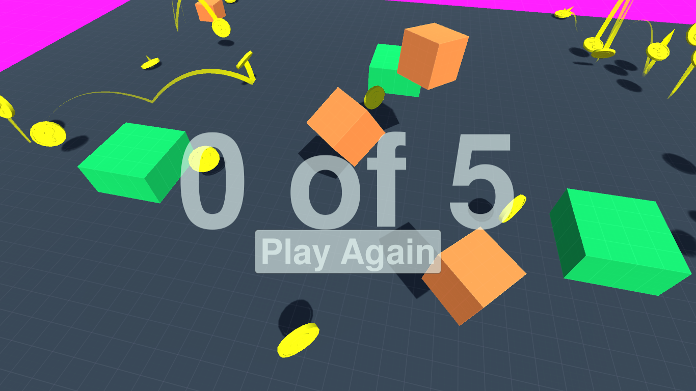

## A simple 2-level game built using unity3d.  :basketball:

This is simple 2-level game, where in the first level you need to score 5 points to cross the level, and in the second level goes on for infinite time untill you die.

Your health is damaged either if you drop off the platform(drop into the pink arena) or you bump yourself into the dropping boxes from the air.

#### Here are some screenshots of the game:

**_Builds for Linux, Mac, Windows and Web are included in the build directory. Although, if you are using the web build then WebGL is required_**